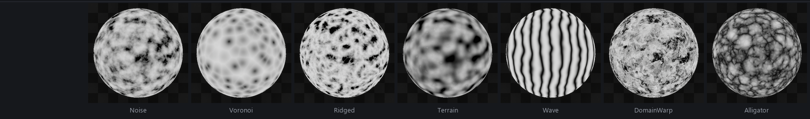
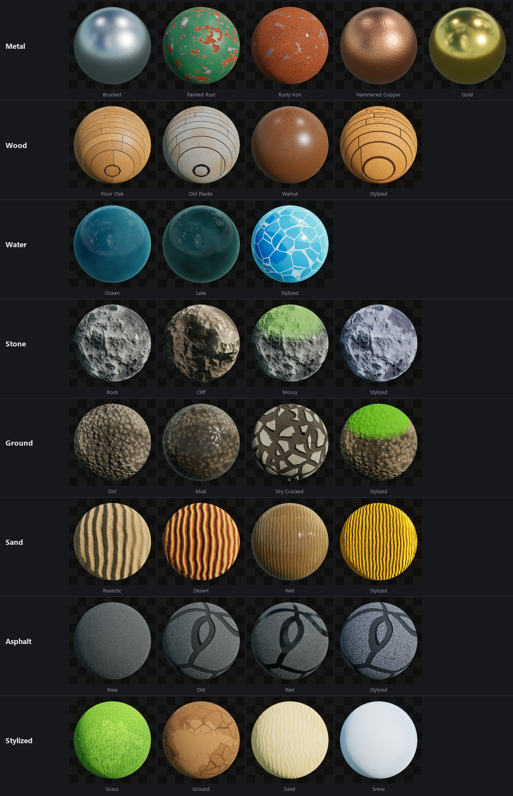
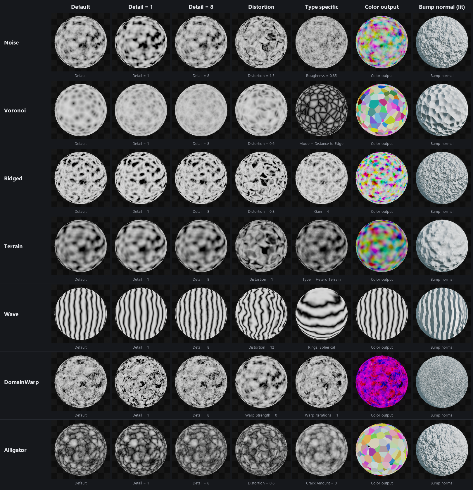
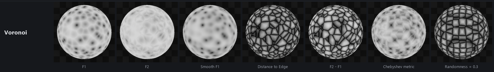
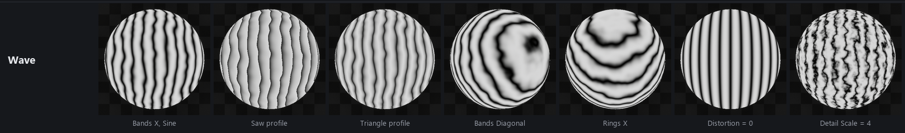
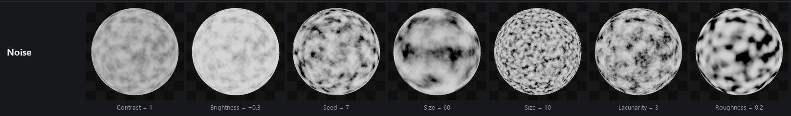

# UE Procedural Noise 3D

**Texture-free 3D procedural noise material functions for Unreal Engine 5.7+.**

Seven material functions inspired by Blender and Houdini noises:
- fractal Perlin
- Voronoi
- ridged multifractal
- terrain multifractal
- waves
- domain warp
- alligator

They use no textures and no UVs, and leave no tiling seams. Everything is evaluated in 3D space, so the noise wraps cleanly around any mesh.



> Requires **Unreal Engine 5.7 or newer**. The `.uasset` files are saved with 5.7 and will not open in older versions.

## What you can build with it

Every material below is **100% procedural**: no textures, no UVs, no tiling. Each one is built from the noises in this pack (Voronoi, Wave, Ridged, Domain Warp, Alligator…) and a handful of color and roughness parameters. Each row is **one** master material; the variants are just material instances with different parameters.



*These showcase materials are not included in this repository. They show what the noise functions can do.*

---

## Installation

1. Download the repository: **Code → Download ZIP**, or `git clone`.
2. Copy the **`Content/N3D`** folder into your project's **`Content`** folder:
   ```
   YourProject/
   └── Content/
       └── N3D/
           ├── MF_N3D_Noise.uasset
           ├── MF_N3D_Voronoi.uasset
           ├── ...
           └── Examples/
   ```
3. Open or restart the editor.

**Keep the folder name `N3D` and place it directly in `Content/`.** The example materials reference the functions by path (`/Game/N3D/...`). If you want the folder somewhere else, move it inside the Content Browser, not in Explorer, so Unreal fixes up the references.

## Usage

- In any material graph, right-click and type **`N3D`**, or find the functions in the palette under the **Noise 3D** category.
- Or drag an `MF_N3D_*` asset from the Content Browser into the graph.
- Plug `Fac`, `Color` or `Normal` wherever you need them.
- `Examples/` contains one minimal preview material per noise (`M_N3D_*_Preview`).

Every input is optional and has a sensible default, so the function works as soon as you drop it in.

### Outputs

| Output | Type | Description |
|---|---|---|
| `Fac` | float | Noise value, 0..1, after contrast, brightness, gamma and invert |
| `Color` | float3 | Random color variation; per cell for Voronoi and Alligator |
| `Normal` | float3 | Tangent-space bump normal. Plug it straight into the **Normal** pin |
| `NormalWS` | float3 | World-space bump normal, for materials with *Tangent Space Normal* off or for custom lighting |

---

## Noises



The table columns are:
- default settings
- `Detail` = 1 (single octave)
- `Detail` = 8 (many octaves)
- distortion / warp
- one type-specific parameter
- the `Color` output
- the `Normal` output on a lit sphere

All spheres use world-space coordinates. For readability, the Noise, Ridged and DomainWarp shots use `Contrast` ≈ 2, and the Wave shots use `Size` 70.

| Function | What it is | Good for |
|---|---|---|
| `MF_N3D_Noise` | 3D fractal Perlin noise (like Blender's *Noise Texture*) | clouds, dirt, variation masks, everything |
| `MF_N3D_Voronoi` | Worley / cellular noise with 5 modes and 4 distance metrics | cells, stones, scales, cracks, tiles |
| `MF_N3D_Ridged` | Musgrave ridged multifractal | marble veins, mountains, rock, lightning |
| `MF_N3D_Terrain` | Hybrid Multifractal / Hetero Terrain | terrain masks, eroded surfaces, stains |
| `MF_N3D_Wave` | Bands or rings with noise distortion | wood, agate, sediment layers, ripples |
| `MF_N3D_DomainWarp` | Domain warping in the style of Inigo Quilez / Houdini | liquid, smoke, marble, flowing patterns |
| `MF_N3D_Alligator` | Houdini-style alligator noise | skin, leather, reptile scales, dry mud |

### Voronoi modes



### Wave variants



### Common controls (on `MF_N3D_Noise`)



---

## Parameters

### Coordinates (all functions)

| Input | Default | Description |
|---|---|---|
| `Space` | 0 | **0** World Position: seamless across meshes.<br>**1** Local Position: sticks to moving static meshes.<br>**2** Pre-Skinned Local Position: sticks to deforming skeletal meshes.<br>**3** the custom `Position` input. |
| `Position` | (0,0,0) | Custom position. Used only when `Space` = 3 |
| `Size` | 100 | Base size of the noise features, in cm |
| `Tiling` | (1,1,1) | Per-axis frequency multiplier, for stretching the noise along an axis |
| `Rotation` | (0,0,0) | Rotation of the noise, in degrees |
| `Offset` | (0,0,0) | Offset in noise space. Animate it to scroll or evolve the noise |
| `Seed` | 0 | Random seed. A different seed gives a different pattern |

### Post-processing (all functions)

| Input | Default | Description |
|---|---|---|
| `Contrast` | 1 | Contrast around 0.5 |
| `Brightness` | 0 | Added after contrast |
| `Gamma` | 1 | Power curve |
| `Invert` | 0 | 0 = normal, 1 = inverted; values in between blend the two |
| `ClampOutput` | 1 | 1 = clamp to 0..1, 0 = leave unclamped |

### Normal (all functions)

| Input | Default | Description |
|---|---|---|
| `NormalStrength` | 1 | Bump strength. At 0 the normal is flat and adds no cost |
| `NormalQuality` | 0 | **0** cheap screen-space derivatives: almost free, slightly faceted up close.<br>**1** accurate 3D gradient: about 4× the noise cost. |

### Per-noise parameters

| Function | Parameters (default) |
|---|---|
| **Noise** | `Detail` (5): octaves, 0..15; fractional values blend smoothly.<br>`Roughness` (0.5): amplitude falloff per octave.<br>`Lacunarity` (2): frequency multiplier per octave.<br>`Distortion` (0). |
| **Voronoi** | `Mode` (0): 0 F1 · 1 F2 · 2 Smooth F1 · 3 Distance to Edge · 4 F2 − F1.<br>`Metric` (0): 0 Euclidean · 1 Manhattan · 2 Chebyshev · 3 Minkowski.<br>`MinkowskiExponent` (0.5).<br>`Randomness` (1): 0 gives a regular grid.<br>`Smoothness` (1): used by Smooth F1.<br>`Detail` (0) · `Roughness` · `Lacunarity` · `Distortion`. |
| **Ridged** | `Detail` (5) · `Roughness` · `Lacunarity` · `RidgeOffset` (1).<br>`Gain` (2): higher gives sharper ridges.<br>`Distortion`. |
| **Terrain** | `TerrainType` (0): 0 Hybrid Multifractal · 1 Hetero Terrain.<br>`Detail` (5) · `Roughness` · `Lacunarity` · `TerrainOffset` (0.5) · `Gain` (1) · `Distortion`. |
| **Wave** | `WaveType` (0): 0 Bands · 1 Rings.<br>`Direction` (0): 0 X · 1 Y · 2 Z · 3 Diagonal / Spherical.<br>`Profile` (0): 0 Sine · 1 Saw · 2 Triangle.<br>`Phase` (0): animate it to move the waves.<br>`Distortion` (5) · `Detail` (2) · `DetailScale` (1) · `Roughness`. |
| **DomainWarp** | `Detail` (5) · `Roughness` · `Lacunarity` · `WarpStrength` (1.5) · `WarpScale` (1).<br>`WarpIterations` (2): 1 = single warp, 2 = double warp (about 2× the cost). |
| **Alligator** | `Detail` (2) · `Roughness` · `Lacunarity` · `Randomness` (1) · `BlobSize` (1).<br>`CrackAmount` (1): 0 = soft blobs, 1 = sharp cracks.<br>`Distortion`. |

---

## Performance tips

- Cost grows roughly linearly with `Detail` (the number of octaves). 3–5 octaves are usually enough; use fewer on mobile.
- `Voronoi` and `Alligator` search the neighbouring cells for every octave, which makes them the most expensive. Keep their `Detail` low.
- `NormalQuality = 1` evaluates the noise 4 times. Leave it at 0 unless you see faceting up close.
- `Distortion` > 0 adds an extra Perlin evaluation per sample.
- For zero runtime cost, bake the result into a texture once you are happy with the look.

## License

[MIT](LICENSE). Free for personal and commercial projects.
